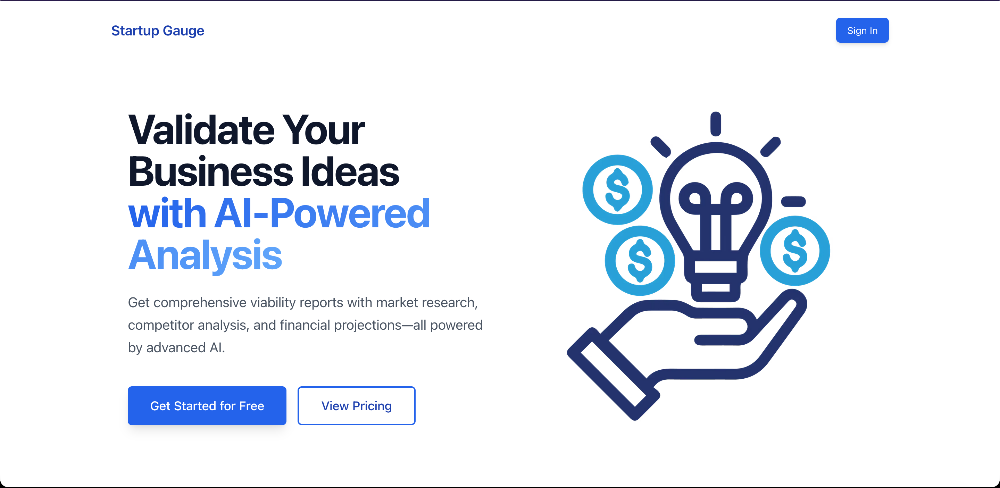
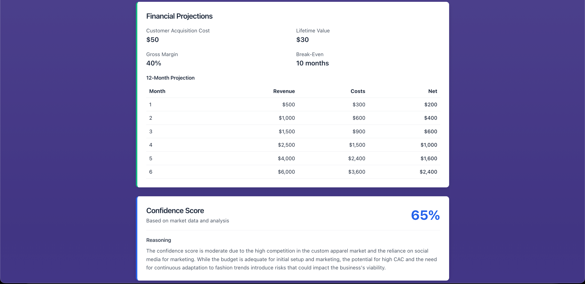
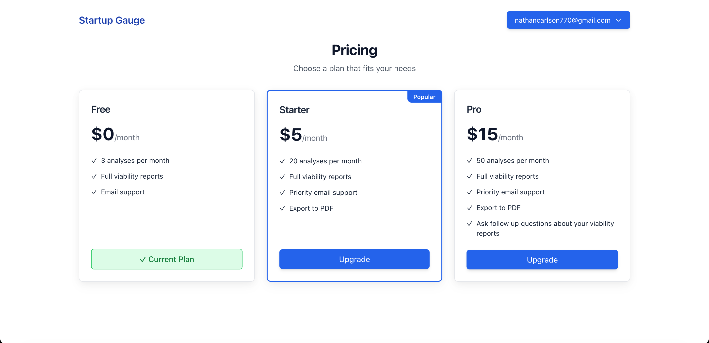

# Startup Gauge

> AI-powered business analysis platform with RAG-enhanced market research, built with Next.js 14, OpenAI, and AWS.

[](https://nextjs.org/)
[](https://www.typescriptlang.org/)
[](https://www.prisma.io/)
[](https://aws.amazon.com/)

**[Live Application](https://production.d223rlfcu71cz9.amplifyapp.com/)** • **[Architecture](docs/ARCHITECTURE.md)** • **[API Reference](docs/API_REFERENCE.md)**

---

## 🎯 Overview

Startup Gauge is a full-stack SaaS application that leverages AI to analyze business ideas and provide comprehensive viability assessments. The platform combines structured analysis with RAG (Retrieval-Augmented Generation) to deliver data-driven insights backed by real market research.

## 📸 Screenshots


<sup>Landing page</sup>


<sup>Viability report with confidence score</sup>


<sup>Pricing page</sup>

### Key Features

- **🤖 AI-Powered Analysis** - Generate detailed viability reports with market sizing, risk assessment, and financial projections
- **🔍 RAG-Enhanced Research** - Automatically discover and ingest relevant market data, competitor information, and industry insights
- **💳 Stripe Integration** - Multi-tier subscription plans with usage metering and automatic billing
- **🔐 AWS Cognito Auth** - Secure user authentication and session management via AWS Amplify
- **📊 Project Management** - Create, save, and track multiple business idea analyses
- **⚡ Real-time Ingestion** - Asynchronous Lambda-based document processing with status tracking
- **📈 Usage Tracking** - Monitor analysis consumption and enforce subscription limits

---

## 🏗️ Tech Stack

### Frontend
- **Next.js 14** (App Router) - React framework with server components
- **TypeScript** - Type-safe development
- **Tailwind CSS** - Utility-first styling
- **Zod** - Schema validation for type-safe API contracts

### Backend
- **Next.js API Routes** - Serverless API endpoints
- **Prisma** - Type-safe ORM with PostgreSQL
- **AWS Lambda** - Serverless document ingestion worker
- **OpenAI API** - GPT-4o-mini for analysis, GPT-4o for discovery, text-embedding-3-small for RAG

### Infrastructure
- **Neon** - Serverless PostgreSQL with pgvector extension
- **AWS Amplify** - Hosting, authentication (Cognito), and deployment
- **AWS Lambda** - Asynchronous RAG processing
- **Stripe** - Payment processing and subscription management
- **Brave Search API** - Market research and URL discovery

---

## 🚀 Features in Detail

### 1. AI Viability Analysis

Submit a business idea and receive structured analysis including:
- Market size estimation
- Customer acquisition and lifetime value projections
- Risk assessment (up to 10 identified risks)
- Step-by-step launch roadmap
- 12-month financial projections
- Confidence scoring (0-100%)

**Powered by:** OpenAI GPT-4o-mini with strict schema validation via Zod

### 2. RAG Discovery System

Enhance analyses with real market data:
1. **Discovery Agent** - AI searches for relevant URLs (competitors, market reports, case studies)
2. **URL Selection** - Review and select relevant resources
3. **Asynchronous Ingestion** - Lambda worker fetches, chunks, and embeds content
4. **Vector Search** - Retrieve context for AI analysis using pgvector similarity search

**Tech:** AWS Lambda + OpenAI Embeddings + pgvector + Brave Search API

### 3. Subscription Management

Three-tier pricing model:
- **Free**: 3 analyses/month
- **Starter ($5)**: 25 analyses/month + detailed reports
- **Pro ($15)**: 100 analyses/month + RAG + AI chat + PDF export

Features:
- Stripe Checkout integration
- Usage metering per billing period
- Subscription upgrade/cancel workflow
- Webhook handling for subscription events
- PDF export for Starter+ plans
- AI chat with RAG context for Pro plans

### 4. Authentication & Authorization

- AWS Cognito via Amplify SDK
- JWT validation on API routes
- User-scoped data access
- Session management

---

## 📁 Project Structure

```
├── app/
│   ├── (app)/              # Authenticated app routes
│   │   ├── pricing/        # Subscription plans
│   │   └── projects/       # Project CRUD + discovery UI
│   ├── api/                # API routes
│   │   ├── viability/      # AI analysis endpoint
│   │   ├── discovery/      # RAG URL discovery + ingestion
│   │   ├── checkout/       # Stripe checkout
│   │   ├── subscription/   # Subscription management
│   │   ├── user/          # User subscription & usage
│   │   ├── health/        # Health check endpoint
│   │   └── webhooks/       # Stripe webhooks
│   ├── layout.tsx          # Root layout with auth
│   └── page.tsx            # Landing page
├── components/
│   ├── auth/               # Auth UI components
│   └── ui/                 # Reusable UI components
├── lib/
│   ├── ai/                 # OpenAI integration + prompt management
│   ├── auth/               # Amplify config + JWT verification
│   ├── db/                 # Prisma client
│   ├── rag/                # Vector search utilities
│   ├── search/             # Brave Search integration
│   └── stripe/             # Stripe client + plans
├── lambda/
│   └── rag-ingestion-worker/  # Document processing Lambda
├── prisma/
│   ├── migrations/         # Database migrations
│   └── schema.prisma       # Data models
└── docs/                   # Documentation
```

---

## 🧪 Available Scripts

```bash
npm run dev          # Start development server
npm run build        # Build for production
npm run start        # Start production server
npm run lint         # Run ESLint
npm run eval         # Run AI prompt evaluation
npm run seed         # Seed database with demo data
npm run seed:reset   # Reset database (delete all data)
npm run fix:prompt   # Update prompt version in database
```

---

## 📊 Database Schema

**Key Models:**

- **User** - Authentication and subscription info
- **Project** - Business idea containers
- **Analysis** - AI-generated viability reports with versioning
- **PromptVersion** - Track prompt changes and model versions
- **Subscription** - Stripe subscription data
- **UsageMeter** - Track monthly analysis consumption
- **DiscoveryJob** - RAG ingestion job tracking
- **DocumentChunk** - Vector-embedded content for RAG

See [prisma/schema.prisma](prisma/schema.prisma) for full schema.

---

## 🚢 Deployment

### Complete Deployment Guide

**See [docs/DEPLOYMENT_GUIDE.md](docs/DEPLOYMENT_GUIDE.md) for the complete step-by-step deployment guide from scratch.**

---

## 📖 Documentation

- **[Complete Deployment Guide](docs/DEPLOYMENT_GUIDE.md)** - **Start here!** Step-by-step guide to deploy from scratch
- **[Architecture Overview](docs/ARCHITECTURE.md)** - System design and data flows
- **[API Reference](docs/API_REFERENCE.md)** - Complete API endpoint documentation
- **[RAG Implementation](docs/RAG_IMPLEMENTATION.md)** - Technical deep dive into RAG system

---

## 🔒 Security

- JWT validation on all authenticated routes
- Rate limiting on API endpoints
- Stripe webhook signature verification
- SQL injection protection via Prisma
- Environment variable validation
- CORS configuration
- Input sanitization with Zod schemas

---

## 📝 License

This project is licensed under the Apache 2.0 License - see [LICENSE.md](LICENSE.md) for details.
