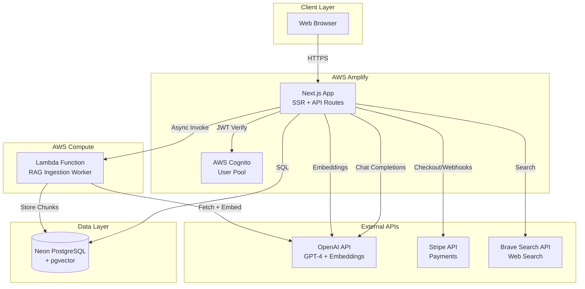
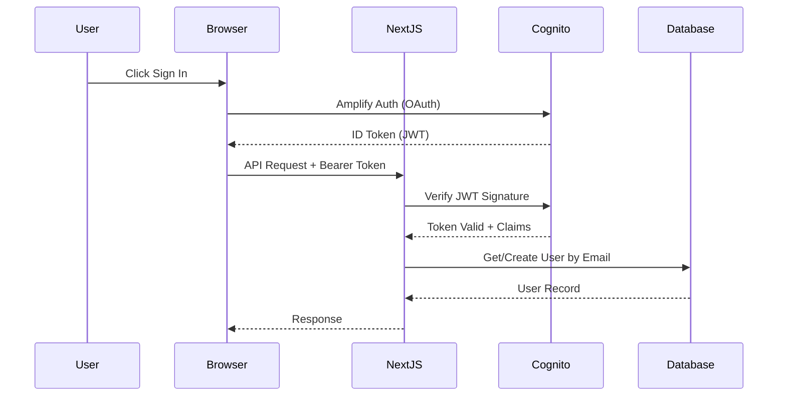
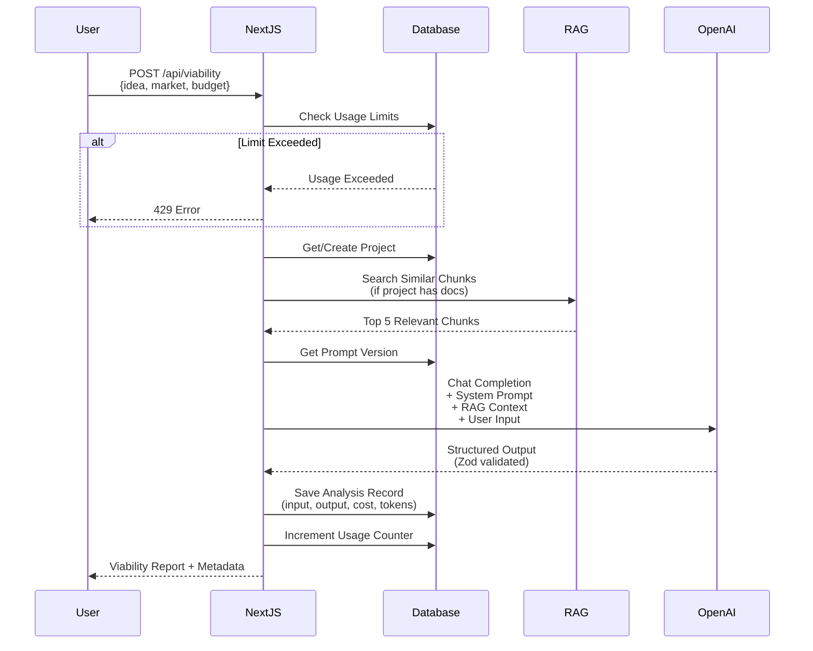
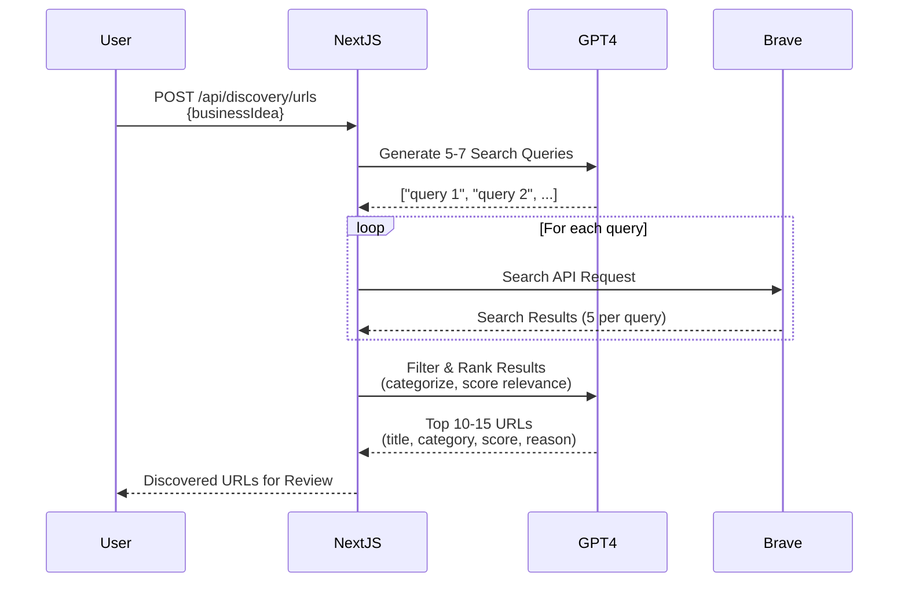
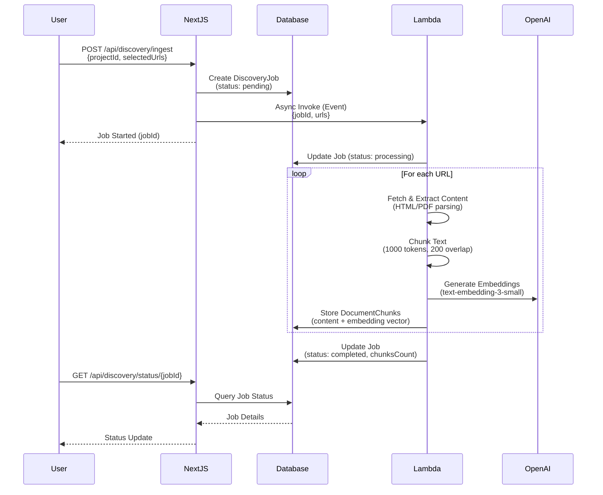
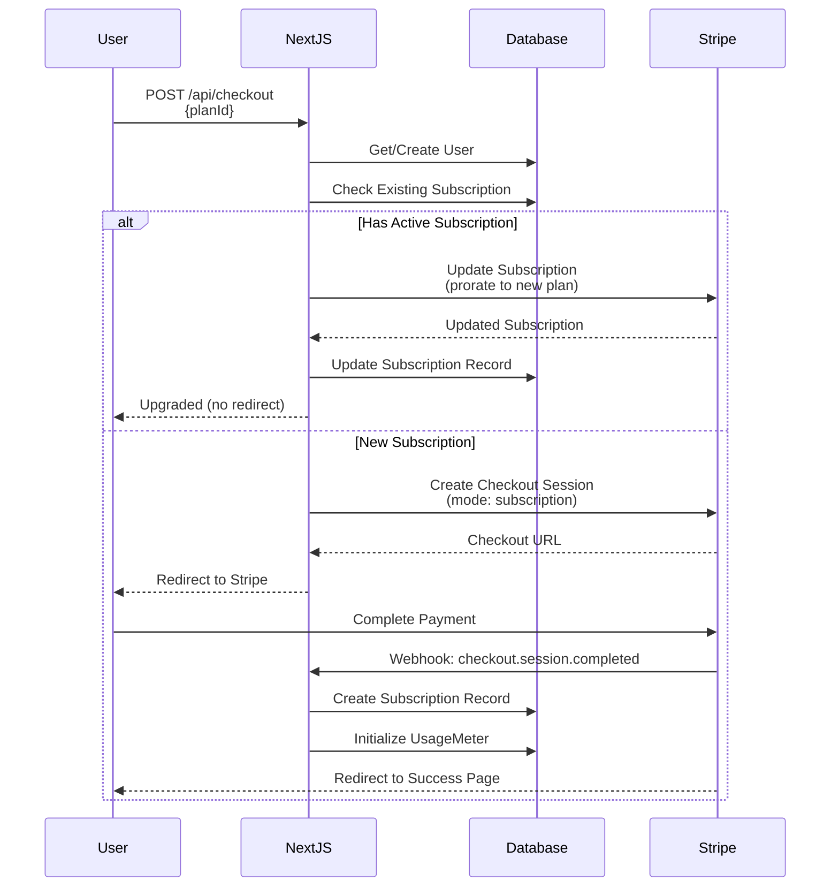
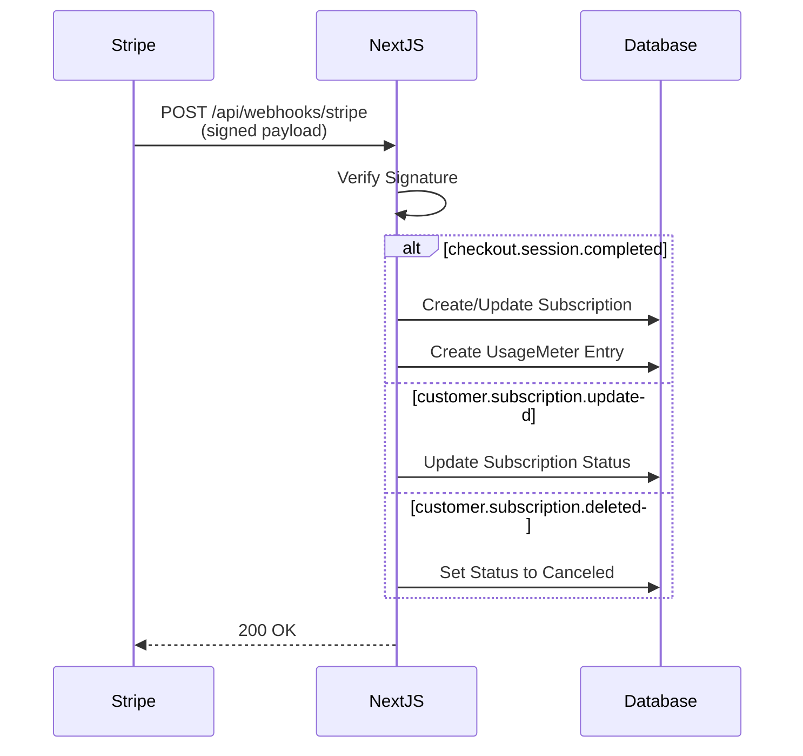
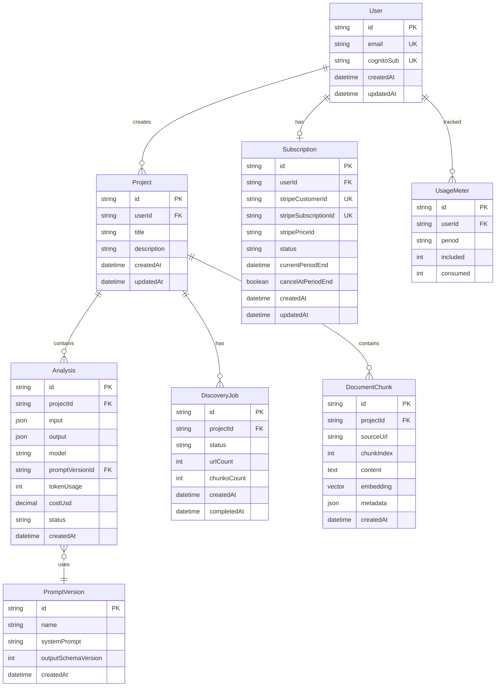

# Architecture Documentation

> System design and technical architecture for Startup Gauge

---

## Table of Contents

1. [System Overview](#system-overview)
2. [High-Level Architecture](#high-level-architecture)
3. [Authentication Flow](#authentication-flow)
4. [AI Viability Analysis Flow](#ai-viability-analysis-flow)
5. [RAG Discovery & Ingestion Pipeline](#rag-discovery--ingestion-pipeline)
6. [Subscription & Payment Flow](#subscription--payment-flow)
7. [Data Model](#data-model)
8. [Technology Decisions](#technology-decisions)
9. [Scalability Considerations](#scalability-considerations)

---

## System Overview

Startup Gauge is a serverless SaaS application built on AWS infrastructure with a Next.js frontend and API layer. The system combines real-time AI analysis with asynchronous document processing for enhanced market research.

**Core Components:**
- **Next.js App** - SSR React application with API routes
- **AWS Cognito** - User authentication and authorization
- **PostgreSQL (Neon)** - Relational database with vector extension
- **AWS Lambda** - Serverless document ingestion worker
- **OpenAI API** - GPT-4 for analysis, embeddings for RAG
- **Stripe** - Payment processing and subscription management

---

## High-Level Architecture



**Request Flow:**
1. User authenticates via AWS Cognito
2. Client sends JWT token with API requests
3. Next.js API routes verify JWT and process requests
4. Synchronous operations return immediately
5. Long-running tasks (RAG ingestion) delegated to Lambda
6. Lambda processes asynchronously and updates database

---

## Authentication Flow



**Key Points:**
- Uses AWS Cognito User Pools via Amplify SDK
- JWT tokens validated on every protected API route
- User records created on-demand from JWT email claim
- Token verification uses `aws-jwt-verify` library
- Sessions managed client-side by Amplify

**Implementation:**
- Auth config: `lib/auth/amplifyClient.ts`
- JWT verification: `lib/auth/verifyJwt.ts`
- Protected routes: All routes in `app/(app)/`

---

## AI Viability Analysis Flow



**Data Flow:**
1. **Input Validation** - Zod schema validates business idea parameters
2. **Auth & Usage Check** - Verify JWT, check subscription tier limits
3. **RAG Context Retrieval** - If project has ingested documents, perform vector search
4. **Prompt Assembly** - Combine system prompt + RAG context + user input
5. **AI Generation** - GPT-4 generates structured JSON response
6. **Schema Validation** - Zod validates output matches expected structure
7. **Persistence** - Save analysis with versioning, cost tracking, and metadata
8. **Response** - Return analysis with usage info

**Schema Validation:**
- Input: `ViabilityInputSchema` (idea, targetMarket, budget, timeline)
- Output: `ViabilityOutputSchema` (summary, risks, steps, profit model, confidence)

**Implementation:**
- API Route: `app/api/viability/route.ts`
- Schemas: `lib/ai/schemas.ts`
- Provider: `lib/ai/providers/openai.ts`
- Prompt Management: `lib/ai/promptManager.ts`

---

## RAG Discovery & Ingestion Pipeline

### Phase 1: URL Discovery



### Phase 2: Asynchronous Ingestion



**Pipeline Stages:**

1. **Content Extraction**
   - Fetch URL content via HTTP
   - Parse HTML with Cheerio
   - Extract text from PDFs with pdf-parse
   - Clean and normalize content

2. **Text Chunking**
   - Split into ~1000 token chunks
   - 200 token overlap between chunks
   - Preserve semantic boundaries

3. **Embedding Generation**
   - Batch chunks (up to 100 per API call)
   - Generate 1536-dim vectors via OpenAI
   - Rate-limited to avoid throttling

4. **Vector Storage**
   - Store in PostgreSQL with pgvector
   - Index by projectId and sourceUrl
   - Include metadata (category, relevance score)

**Implementation:**
- Discovery API: `app/api/discovery/urls/route.ts`
- Ingestion API: `app/api/discovery/ingest/route.ts`
- Status API: `app/api/discovery/status/[jobId]/route.ts`
- Lambda Worker: `lambda/rag-ingestion-worker/src/index.ts`
- Extractor: `lambda/rag-ingestion-worker/src/extractor.ts`
- Chunker: `lambda/rag-ingestion-worker/src/chunker.ts`
- Embeddings: `lambda/rag-ingestion-worker/src/embeddings.ts`
- Vector Search: `lib/rag/vectorSearch.ts`

---

## Subscription & Payment Flow

### Checkout Flow



### Webhook Processing



**Subscription Tiers:**
- **Free**: 3 analyses/month (no Stripe subscription)
- **Starter ($29)**: 25 analyses/month
- **Pro ($99)**: 100 analyses/month + RAG access

**Usage Metering:**
- Tracked per user per billing period (YYYY-MM)
- Reset monthly automatically
- Enforced before AI analysis calls
- `UsageMeter` model tracks included vs consumed

**Implementation:**
- Checkout: `app/api/checkout/route.ts`
- Cancel: `app/api/subscription/cancel/route.ts`
- User Subscription: `app/api/user/subscription/route.ts`
- Webhooks: `app/api/webhooks/stripe/route.ts`
- Plans Config: `lib/stripe/plans.ts`
- Usage Check: `lib/stripe/checkUsage.ts`

---

## Data Model



**Key Relationships:**
- One user can have multiple projects
- Each project can have multiple analyses and RAG documents
- Analyses are versioned by prompt version for A/B testing
- Subscriptions are 1:1 with users
- Usage is metered per user per billing period
- Document chunks are scoped to projects with vector embeddings

**Indexes:**
- `User.email` - Unique index for auth lookups
- `DocumentChunk.projectId` - For RAG retrieval
- `DocumentChunk.sourceUrl` - For deduplication
- `UsageMeter.(userId, period)` - Composite unique index

---

## Technology Decisions

### Frontend Framework: Next.js 14

**Why Next.js:**
- Server-side rendering for SEO and performance
- API routes eliminate need for separate backend
- File-based routing simplifies navigation
- Built-in optimization (images, fonts, bundles)
- Excellent TypeScript support

**App Router Benefits:**
- React Server Components reduce client bundle size
- Streaming and suspense for better UX
- Nested layouts for auth boundaries
- Server actions for mutations (future)

### Database: Neon PostgreSQL

**Why Neon:**
- Serverless architecture (scales to zero)
- Built-in connection pooling
- pgvector extension for embeddings
- Generous free tier (10GB storage)
- Low latency from AWS regions

**Why PostgreSQL:**
- ACID compliance for financial data (subscriptions)
- Rich JSON support for flexible schemas
- Vector similarity search (pgvector)
- Strong ecosystem and tooling

### ORM: Prisma

**Why Prisma:**
- Type-safe database client
- Automatic migration management
- Intuitive schema definition
- Excellent TypeScript integration
- Built-in connection pooling

### Authentication: AWS Cognito

**Why Cognito:**
- Managed service (no auth maintenance)
- Integrates with AWS Amplify
- Supports social login (future)
- MFA and advanced security features
- Built-in user management UI

### Compute: AWS Lambda

**Why Lambda for RAG:**
- Asynchronous processing without blocking API
- Auto-scaling for concurrent jobs
- Pay-per-execution (cost-effective)
- Timeout up to 15 minutes
- No server management

**Why Not Lambda for Main App:**
- Next.js SSR requires persistent server
- Complex routing and middleware
- Amplify Hosting better suited for Next.js

### AI Provider: OpenAI

**Why OpenAI:**
- GPT-4 best-in-class for structured output
- JSON mode ensures valid responses
- Embeddings model optimized for RAG
- Reliable API with good rate limits
- Excellent documentation

### Payments: Stripe

**Why Stripe:**
- Industry-standard payment processor
- Built-in subscription management
- Webhook-based event system
- Test mode for development
- Comprehensive dashboard

### Search: Brave Search API

**Why Brave:**
- Free tier (2,000 searches/month)
- No Google dependency
- Privacy-focused
- Good result quality
- Simple REST API

---

## Scalability Considerations

### Current Architecture (MVP)

**Bottlenecks:**
- Single Neon database instance
- Synchronous OpenAI calls in API routes
- Lambda cold starts for RAG jobs
- No caching layer

**Capacity:**
- ~100 concurrent users
- ~1,000 analyses/day
- ~50 RAG jobs/day

### Future Optimizations

**Database:**
- Add read replicas for analytics queries
- Implement connection pooling (PgBouncer)
- Partition DocumentChunk table by projectId
- Add materialized views for dashboards

**Caching:**
- Redis for session data and rate limiting
- CDN (CloudFront) for static assets
- Cache common analyses (e.g., "coffee shop")
- Edge caching for API responses (Vercel Edge)

**Compute:**
- Use Lambda provisioned concurrency for RAG
- Implement job queue (SQS) for batching
- Add background workers for async tasks
- Consider Step Functions for complex workflows

**AI Optimization:**
- Batch multiple analyses in single request
- Use smaller models for simple queries
- Implement prompt caching (Anthropic)
- Fine-tune models for specific domains

**Monitoring:**
- CloudWatch dashboards for metrics
- Sentry for error tracking
- PostHog for product analytics
- AWS X-Ray for tracing

### Cost at Scale

**10,000 users, 50K analyses/month:**
- OpenAI: ~$500-1,000 (GPT-4 + embeddings)
- Neon: ~$50-100 (storage + compute)
- AWS Lambda: ~$20-50 (RAG processing)
- Stripe: 2.9% + 30¢ per transaction
- Amplify: ~$50-100 (hosting + bandwidth)
- **Total: ~$650-1,300/month** (before revenue)

**Break-even:** ~50 Starter subscribers or ~15 Pro subscribers

---

## Security Considerations

**Authentication:**
- JWT tokens validated on every request
- Tokens expire after 1 hour
- Refresh tokens for long sessions
- User-scoped database queries

**API Protection:**
- CORS configured for Amplify domain
- Rate limiting per user (future)
- Input validation with Zod
- SQL injection protection via Prisma

**Payment Security:**
- Stripe webhook signature verification
- PCI compliance handled by Stripe
- No credit card data stored locally
- Subscription status validated on every analysis

**Data Privacy:**
- User data scoped by userId in all queries
- JWT claims used for authorization
- Environment variables for secrets
- HTTPS enforced everywhere

**Infrastructure:**
- IAM roles with least privilege
- Lambda execution role scoped to RDS
- Secrets in AWS Secrets Manager (future)
- VPC for database (production)

---

## Deployment Architecture

**Development:**
```
Local Machine
├── Next.js Dev Server (localhost:3000)
├── Neon DB (remote)
└── AWS Lambda (remote or local SAM)
```

**Production:**
```
AWS Amplify
├── Next.js SSR (Auto-scaled)
├── CloudFront CDN
├── AWS Cognito User Pool
└── Route 53 (Custom Domain)

AWS Lambda
└── RAG Worker (Event-driven)

Neon
└── PostgreSQL (Serverless)

External
├── OpenAI API
├── Stripe API
└── Brave Search API
```

**CI/CD:**
- GitHub push triggers Amplify build
- Automatic preview deployments for PRs
- Environment-specific secrets
- Zero-downtime deployments

---

## Next Steps

**Phase 2-3 (Weeks 2-3):**
- Add comprehensive error handling
- Implement user dashboard with analytics
- Enhance landing page with feature showcase
- Add loading states and optimistic UI

**Phase 4-5 (Weeks 3-4):**
- Complete production deployment to AWS
- Set up monitoring and alerting
- Add rate limiting and security hardening
- Performance optimization

**Future Enhancements:**
- API access for Pro tier
- Team collaboration features
- PDF export for reports
- Comparative analysis (multiple ideas)
- Semantic chunking for better RAG
- WebSocket for real-time job updates

---

**Last Updated:** November 2024  
**Version:** 1.0

